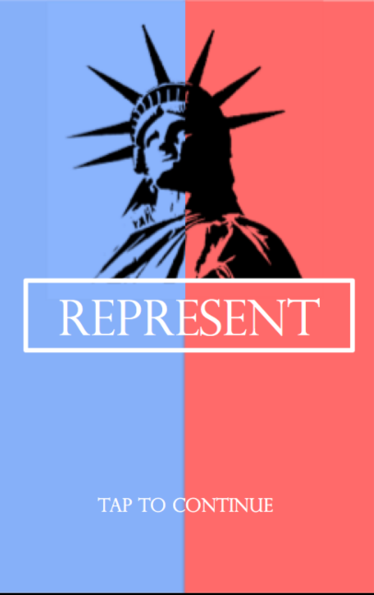
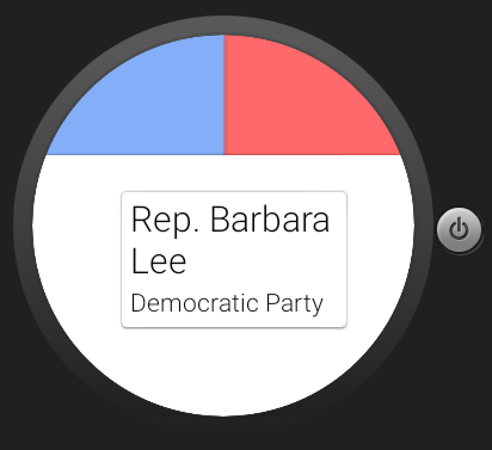
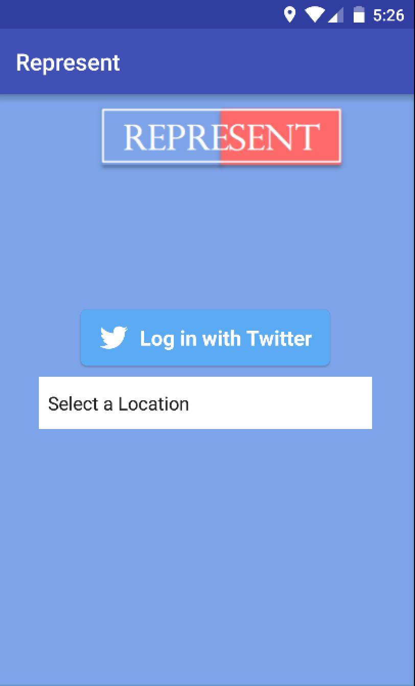
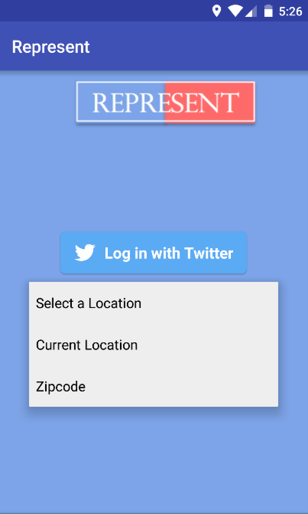
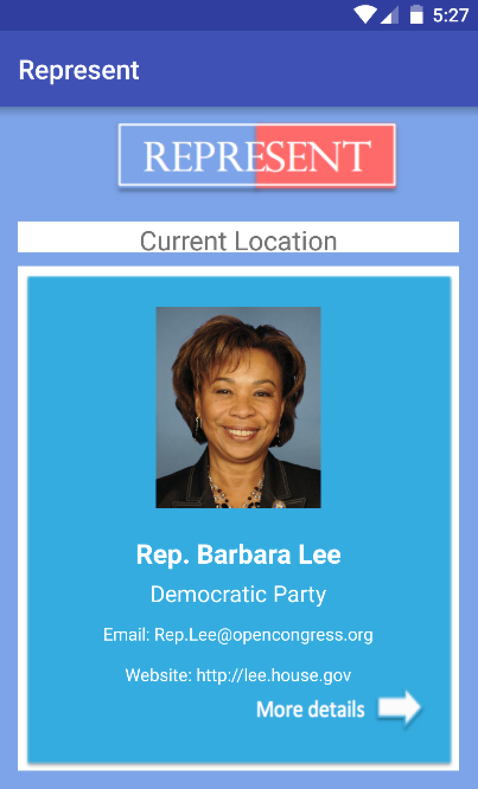
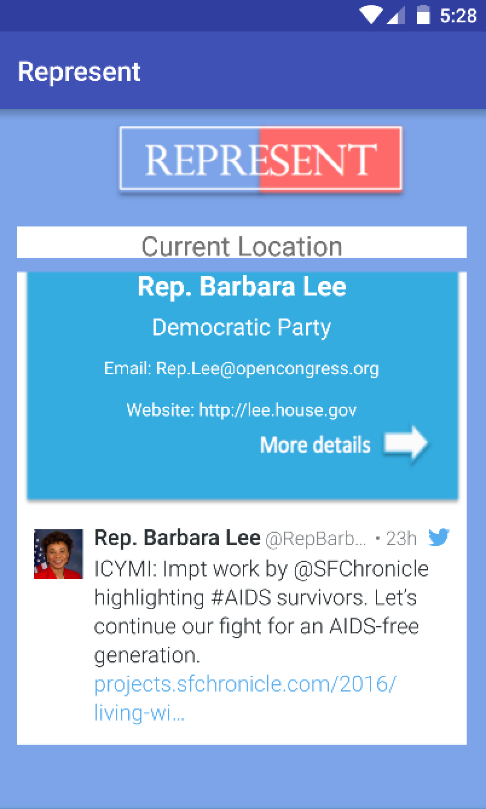
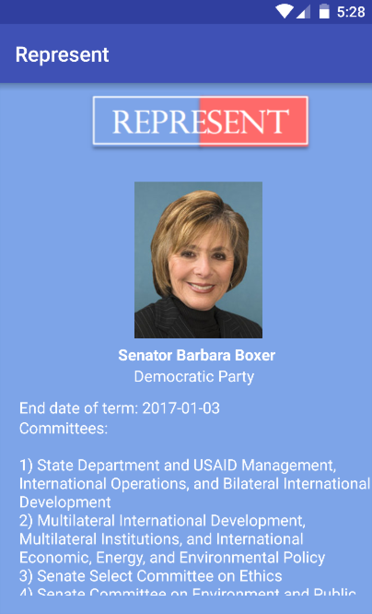
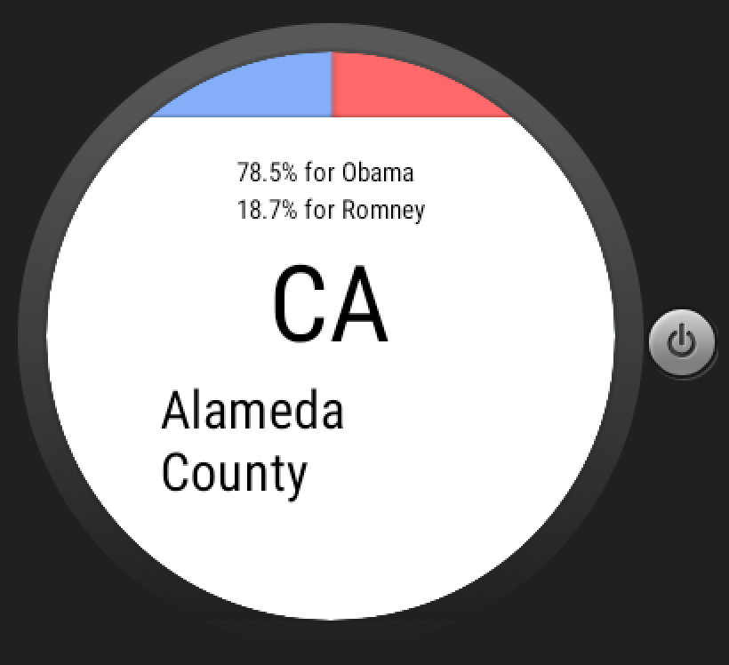

# PROG 02: Represent!

This application uses a combination of mobile views and watch views. The main role the app plays is to keep users up to date on the congressional representatives of the U.S. by zip code, county, or the current location of the user. By viewing the representatives on the phone, notifications are sent to the watch. Obviously, the information on the watch is limited to name and party since the watch has a much smaller face than the phone. Tapping on the watch view can take the user to the detailed view on the mobile.

## Authors

Aparna Narayan ([anarayan@berkeley.edu](mailto:anarayan@berkeley.edu))

## Demo Video

See [Prog2C] (https://www.youtube.com/watch?v=h_D1rLCldaM)

## Screenshots

## Acknowledgments

* Hat tip to anyone who's code was used
* Any other support
